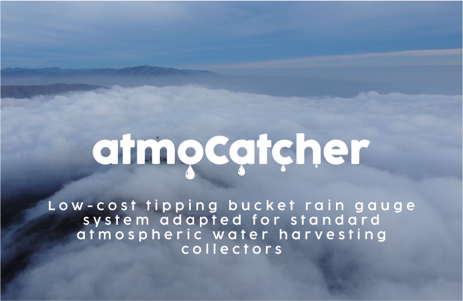
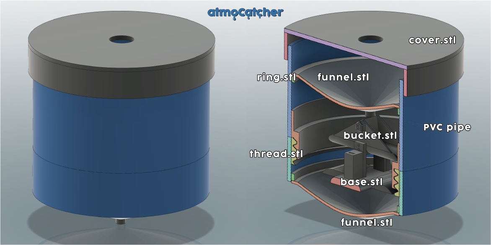
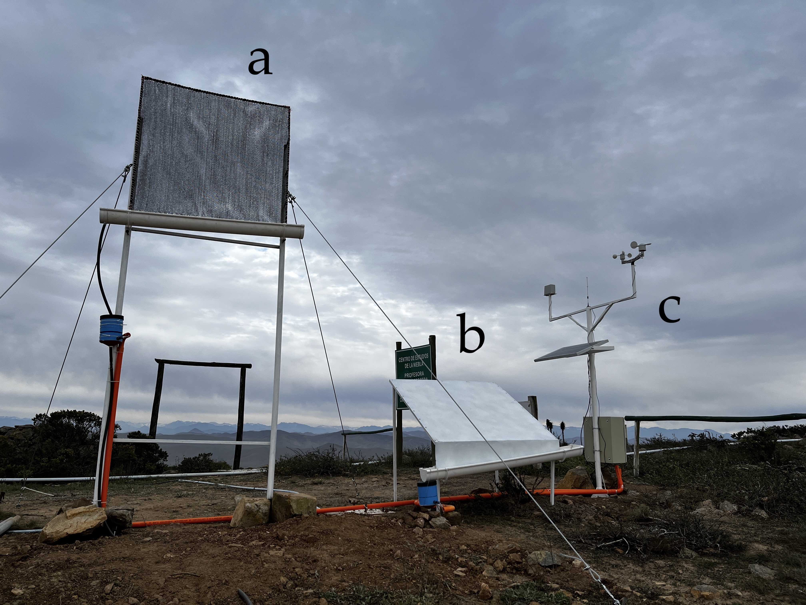

# Introducing atmoCatcher

> a low-cost tipping bucket rain gauge system adapted for standard atmospheric water harvesting collectors.

## What is atmoCatcher?

*atmoCatcher* is a low-cost tipping bucket rain gauge system adapted for standard atmospheric water harvesting collectors. It is designed to be used in conjunction with a standard atmospheric water harvesting collector to measure the amount of water collected, such as standard fog collectors or dew collectors. The system is designed to be low-cost, easy to build, and easy to use.

The idea of the *atmoCatcher* system is to provide a low-cost solution for measuring the amount of water collected by atmospheric water harvesting collectors. This work is part of the final project in order to obtain the degree of Agronomist Engineer in University of La Serena.

## How does it work?

The *atmoCatcher* system is based on the [tipping bucket rain gauge](https://en.wikipedia.org/wiki/Tipping_bucket_rain_gauge) design. The system consists of a funnel that collects water and directs it to a tipping bucket. The tipping bucket is a small bucket that is balanced on a pivot. When the bucket fills with water, it tips over and dumps the water out. The bucket is connected to a reed switch sensor that detects when the bucket tips over.

## How do I read the data?

The atmoCatcher system is designed to be used with a microcontroller, such as an Arduino, ESP32 or Raspberry Pi Pico. The reed switch sensor is connected to a microcontroller that counts the number of times the bucket tips over. The circuit of the reed switch can be powered by the microcontroller (3.3V or 5V), or by a separate power source. The reed switch sensor is connected to the microcontroller through a digital input pin.

## Does every tip represent the same amount of water?

No, the amount of water collected by each tip depends on the size of the bucket and the harvesting intensity. The harvesting intensity is the amount of water collected per unit area per unit time. The harvesting intensity depends on the type of collector and the environmental conditions.

For this purpose, the atmoCatcher system has a calibration equation that converts the number of tips to the amount of water collected and corrects the aoumnt by intensity. The calibration equation is:

$$\hat{y}=2.35+0.05x$$

Where $\hat{y}$ is the tip resolution in milliliters, and $x$ is the intensity (l/h).

In ther words, the atmoCatcher system is calibrated to collect 2.35 milliliters of water per tip at an intensity of 0 l/h, and 0.05 milliliters of water per tip per l/h of intensity.

## How can I build my own atmoCatcher?

For building your own atmoCatcher, you will need the following materials:

 - PLA+ 3D printer filament (~$18USD/kg)
 - 3D printer
 - 3D printed parts (see [3Dfiles](./3dfiles))
 - PCB prototype board ($0.4USD/piece)
 - Cable (from $0.2USD/meter)
 - SP21 connector ($4USD/piece)
 - PVC pipe of 125 mm diameter (price varies according to length)
 - A microcontrolelr (Arduino, ESP32, etc.). Code here is fow Raspberry Pi Pico W ($10USD/board)
 - Reed switch sensor ($0.5USD/piece)
 - Mini magnet ($0.1USD/piece)
 - 10k resistor ($0.1USD/piece)
 - 1uF capacitor ($0.1USD/piece)
 - Jumper cables ($0.1USD/piece)
 - Screw terminal block: 2 pins ($1.5USD/piece)

Then, just follow the following shchema to build your own atmoCatcher:

## Use case

*atmoCatcher* in action!

  a. Standard fog collector  
  b. Standard dew collector  
  c. Atmospheric sensors

## Version

The current version of the atmoCatcher system is v0.0.1. There are still some things to improve, but the system is fully functional and ready to use.

## Authors

 - Ignacia Calderón
 - [Aldo Tapia](https://www.linkedin.com/in/aldo-tapia)

## To do

Although the atmoCatcher system is fully functional, there are still some things to do:

 - Increase the funnel opening
 - Change the position where the magnet is placed
 - Adapt the base to the new magnet position
 - Add holes to avoid water accumulation in the base
 - Design a support system

